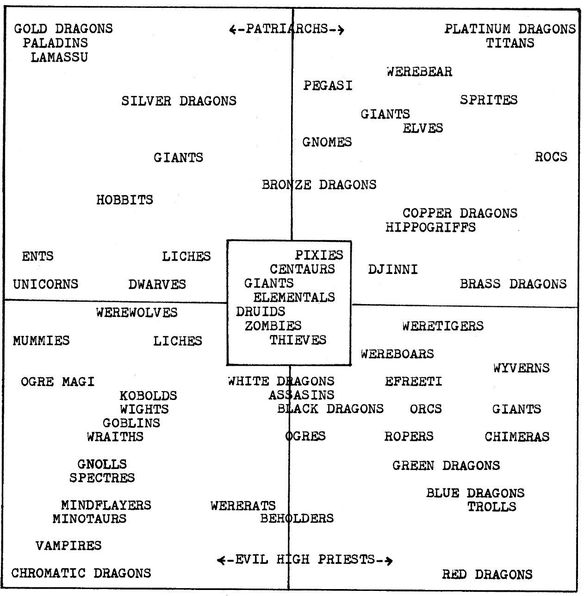

::::columns

:::{.column width="75%"}
I am Professor of Sociology and Political Science and Director of the [Worldview Lab](https://kenan.ethics.duke.edu/worldview-lab/){target="_blank"} at Duke University. I am also Editor-in-Chief of [_Sociological Science_](https://sociologicalscience.com/category/articles/){target="_blank"}.

### Research Interests

The main goal of my research is to understand moral and political beliefs: what they are, where they come from, and what they do. I pursue these questions in the broader interdisciplinary context of [cultural evolution](https://culturalevolutionsociety.org/){target="_blank"}. The picture at the bottom of this page only half-jokingly summarizes my [general understanding of moral differences](files/morality-and-politics.pdf).

The past few years I have been working on how to use patterns in longitudinal data to help adjudicate between competing theories of [cultural change](https://scholar.google.com/citations?view_op=view_citation&hl=en&user=cr6RG1QAAAAJ&citation_for_view=cr6RG1QAAAAJ:Vch7EZszQGgC) and socialization.

I also teach several short courses on applied statistics through [Statistical Horizons](https://statisticalhorizons.com/){target="_blank"} and work with them as Director of Strategic Initiatives.

You can check out the rest of my work on [Google Scholar](https://scholar.google.com/citations?hl=en&user=cr6RG1QAAAAJ&view_op=list_works&sortby=pubdate){target="_blank"}.

{width=67% fig-align="center"}

:::

:::{.column width="5%"}
:::

:::{.column width="20%"}
{.circular-image}
:::
::::